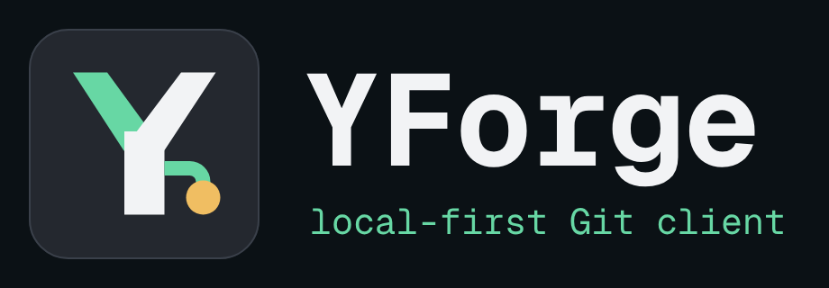
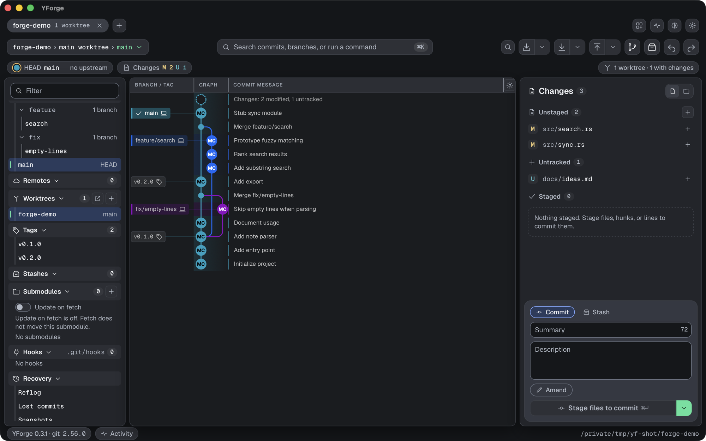

<p align="center">
  
</p>

<p align="center">
  <a href="https://github.com/Althenia/YForge/releases/latest"></a>
  <a href="LICENSE"></a>
  
</p>

<p align="center"><b>A fast, local-first desktop Git client for macOS.</b><br>
Commit graph, staging, branches, stashes, conflict resolution, worktrees, and undo. No account, no cloud service.</p>

<p align="center">
  
</p>

YForge drives the `git` already on your Mac, so your hooks, config, signing, and credential helpers behave exactly as they do in the terminal. The core is Rust, the shell is Tauri 2, and the interface is SolidJS.

## Why YForge

- **Local-first.** Every Git operation works offline and needs no sign-in. Beyond your own remotes, the app reaches the network only for things you set up or ask for (hosting and AI providers, update checks) and for Gravatar profile pictures, which are on by default and switch off in Settings → Privacy & diagnostics.
- **System Git.** YForge runs the `git` CLI (2.39 or newer) instead of reimplementing it.
- **State always visible.** One strip shows HEAD, the branch and its upstream, and your local changes, with the running Git operation named when there is one.
- **Safer risky moments.** Rebase, conflicts, and force pushes are handled with explicit steps, and Undo and Redo sit in the toolbar.
- **Worktrees as first-class citizens.** Linked worktrees appear in the sidebar and as tabs.
- **Credentials stay in the Keychain.** AI keys, platform tokens, and SSH passphrases are stored in the macOS Keychain. Usage diagnostics are off by default and, when you turn them on, are written to your local app database.

## Features

**History and graph**
- Virtualized commit graph with lane-tinted rows, branch and tag labels, and a resizable graph column.
- Commit inspector, diff viewer, and file history and blame for any file.
- Command palette (⌘K) that covers repository actions, file history, zoom, themes, and logs; ⇧⌘O searches repositories.

**Everyday work**
- Staging by file, hunk, and line; multi-select with Stage, Discard, Ignore, and Stash; Path or Tree file lists.
- Commit, amend, and edit the HEAD message; stashes; tags; clone, open, and create from the Launchpad.
- Fetch, Pull, and Push as separate controls, with Push and Publish target pickers.
- Undo and Redo (⇧⌘Z) for the last operation.

**Conflicts and integration**
- Merge Tool with Yours and Theirs side by side, per-conflict choice, and an editable result.
- External merge tool, diff tool, and editor support.
- Merge prediction forecasts conflicting files before a pull request is created or a branch is published.

**Worktrees and Git extras**
- Worktrees, submodules, Git hooks (view, run, and test in a temporary worktree), Git Flow, Git LFS settings, and commit signing (OpenPGP, SSH, X.509).
- Profiles with their own author name, email, and open tabs, without touching your Git config.

**Hosting platforms**
- Pull request and merge request lists, detail, creation, and merge for GitHub, GitLab, and Bitbucket, using personal access tokens. Self-hosted servers are supported.
- A pull request compose view with branch comparison, incoming commits, and PR checks.
- Jira connections.

**Optional AI assistance**

Off until you switch a feature on. Explain changes or a commit, compose commits from your changes, draft stash messages and pull request titles and bodies, and write or amend commit messages. Bring your own provider:

| Provider | Sign in with |
|---|---|
| ChatGPT | API key or ChatGPT subscription |
| Claude | API key or Claude Code subscription |
| OpenRouter | API key |
| OpenAI-compatible endpoint | API key and base URL |

**Editor and appearance**
- Light and dark themes plus Classic Dark, Ocean, Eighties, Gruvbox, Nord, Dracula, Monokai, and Woodland.
- Vim mode in the file editor; optional language servers with definition and reference navigation.
- Image, rendered Markdown, and sandboxed HTML previews of any revision.

See the [CHANGELOG](CHANGELOG.md) for what each release added.

## Install

1. Download the DMG for your Mac from the [latest release](https://github.com/Althenia/YForge/releases/latest): `YForge_<version>_aarch64.dmg` for Apple silicon or `YForge_<version>_x64.dmg` for Intel.
2. Open the DMG and drag **YForge** to **Applications**.
3. Launch YForge and open a repository from the Launchpad with **Open…**, **Clone…**, or **Create…**, or drop a folder onto it.

**Requirements:** macOS 13.3 or newer and Git 2.39 or newer.

**First launch.** The build is not signed with an Apple Developer ID and is not notarized, so Gatekeeper may block a downloaded copy. Allow it in System Settings → Privacy & Security, or clear the quarantine flag:

```bash
xattr -dr com.apple.quarantine /Applications/YForge.app
```

Because the signature is ad-hoc, macOS asks again for stored AI keys, platform tokens, and SSH passphrases for each new build. Updates come from GitHub Releases as signed builds, and the check runs from the in-app update dialog.

**Command line.** Install the `yforge` command from Settings → General → Install yforge command. It writes `~/.local/bin/yforge`, so put `~/.local/bin` on your `PATH`. Then `yforge <path>` opens a repository in the running window:

```bash
yforge ~/code/my-project
```

## Configuration

| Variable | Effect |
|---|---|
| `YFORGE_REPO` | Repository opened at launch (otherwise the first CLI argument, otherwise the current directory when it is a repository). |
| `YFORGE_DATA_DIR` | Directory for the app database (settings, recents, tabs, interface preferences). Use it to keep test runs out of your real app data. |
| `RUST_LOG` | Log filter. Defaults to `warn` in release builds and `warn,yforge_lib=debug` in debug builds. |

## Documentation

- [CHANGELOG.md](CHANGELOG.md): what each release added.
- [docs/USER_FLOWS.md](docs/USER_FLOWS.md): the core workflows, step by step.
- [docs/MVP_SCOPE.md](docs/MVP_SCOPE.md): goals, users, and what is in and out of scope.
- [docs/YFORGE_PRODUCT_DIRECTION.md](docs/YFORGE_PRODUCT_DIRECTION.md): product principles and positioning.
- [docs/CORE_UI_CONTRACT.md](docs/CORE_UI_CONTRACT.md): commands, events, and errors between the core and the UI.
- [docs/PLATFORM_INTEGRATIONS.md](docs/PLATFORM_INTEGRATIONS.md) and [docs/AI_PROVIDERS_V2.md](docs/AI_PROVIDERS_V2.md): integration design.

<details>
<summary><b>Build from source</b></summary>

You need Rust stable (with `clippy` and `rustfmt`; verified with 1.98.1), Node.js (verified with 24.21.0), pnpm (verified with 12.4.1), and Git 2.39 or newer.

```bash
git clone https://github.com/Althenia/YForge.git
cd YForge/app
pnpm install
pnpm tauri dev      # Vite on http://localhost:1420 plus the Tauri shell
```

To build the app and DMG for your architecture:

```bash
pnpm tauri build
```

Outputs: `target/release/bundle/macos/YForge.app` and `target/release/bundle/dmg/YForge_<version>_<arch>.dmg`. To sign a local build with a stable identity so Keychain "Always Allow" survives rebuilds:

```bash
APPLE_SIGNING_IDENTITY="YForge Local Signing" pnpm tauri build
```

Try a build against a repository without touching your real settings:

```bash
YFORGE_REPO=<repository path> YFORGE_DATA_DIR=<scratch directory> \
  target/release/bundle/macos/YForge.app/Contents/MacOS/YForge
```

Note that `cargo build` produces `target/debug/YForge`, which loads the dev URL and shows a blank window unless `pnpm dev` is running. Use `pnpm tauri build` for a self-contained app.

</details>

## Project structure

```text
.
├── app/                  # Desktop app: SolidJS frontend (src/) and Tauri shell (src-tauri/)
├── brand/                # Logos, app icon, fonts, third-party provider marks
├── crates/
│   ├── yforge-core/      # Git parsing, graph layout, operations, local store
│   ├── yforge-ai/        # AI provider adapters and features
│   └── yforge-platform/  # GitHub, GitLab, and Bitbucket adapters
├── docs/                 # Product, contract, and design documents
├── scripts/              # Repository and release verification scripts
├── DESIGN.md             # Brand design rules
└── CHANGELOG.md
```

## Contributing

Run these before opening a pull request.

From the repository root:

```bash
cargo test
cargo clippy --all-targets
cargo fmt --check
```

From `app/`:

```bash
pnpm typecheck
pnpm test
pnpm build
```

- After changing a type in `crates/yforge-core/src/model.rs` or `error.rs`, run `pnpm bindings` in `app/` to regenerate the TypeScript bindings.
- UI changes follow [DESIGN.md](DESIGN.md) and [app/DESIGN.md](app/DESIGN.md). Change a rule before the work that depends on it, then run the strict design lints listed in [AGENTS.md](AGENTS.md). `pnpm test` also checks that `app/DESIGN.md` and `app/src/styles/tokens.css` agree, that the bindings are current, and that text and graphic color pairs meet WCAG contrast in both themes.
- Large-data UI flow checks (they use an installed Google Chrome and ports 1421 and 1422), from `app/`:

  ```bash
  node ../scripts/verify-repository-render.mjs
  node ../scripts/verify-workspace-transitions.mjs
  ```

The app version has one source: `version` in `app/package.json`. Pushing a matching `v*` tag on `main` runs the verification checks and creates a draft GitHub release; both Mac architectures upload to it, and it is published only after the downloaded assets' sizes, SHA-256 digests, and updater records check out.

## License

YForge is licensed under the [GNU Affero General Public License v3.0](LICENSE). The Geist fonts in `brand/fonts/` are under the SIL Open Font License ([OFL.txt](brand/fonts/OFL.txt)). The OpenAI and OpenRouter marks in `brand/third-party/` are trademarks of their owners, used unmodified to identify their providers under the terms recorded in [SOURCE.md](brand/third-party/SOURCE.md); YForge claims no endorsement.
